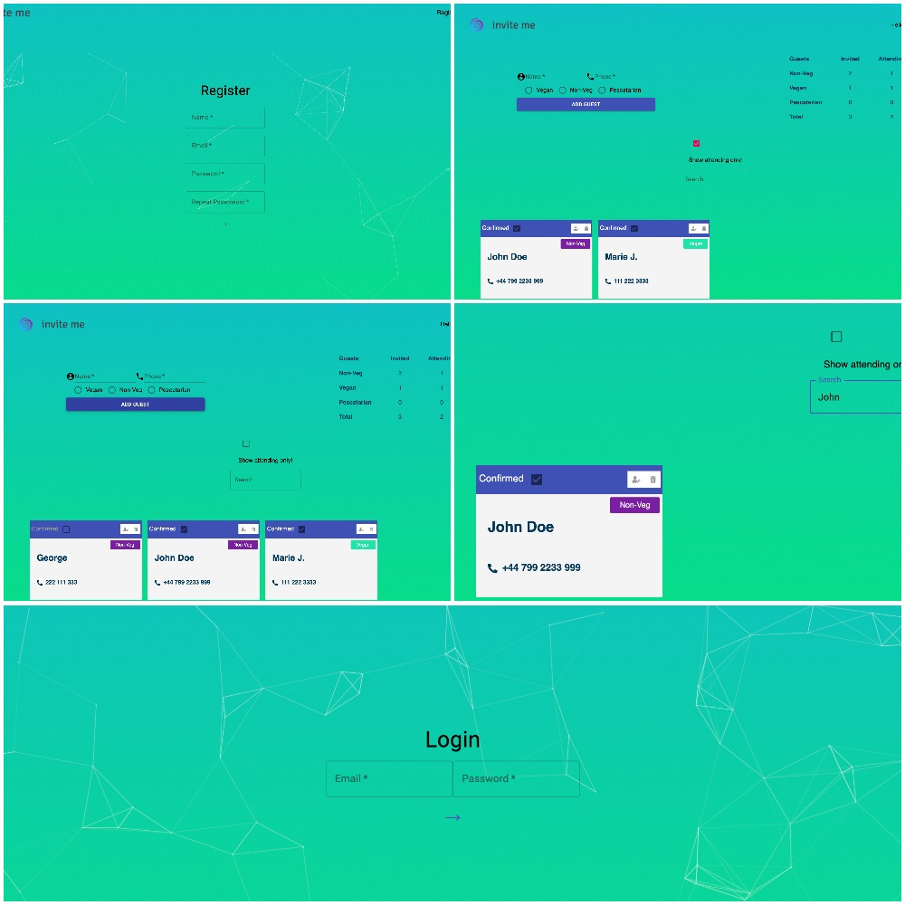

# invite-Me

Fully responsive, with own server, invitations system web app using React.js, where user can easily manage invitations. Each user can create an account an manage it. 

Available routes:
- `/home`
- `/register`
- `/login`

## Table of contents
* [Technologies](#technologies)
* [Setup](#setup)
* [Used packages and tools](#used-packages-and-tools)
* [Display](#display)


## Technologies

- React.js 
- Context API
- React Hooks
- Material UI
- JavaScript ES6
- Mongo DB


## Setup

```bash
  git clone https://github.com/octaviandd/invite-Me.git
  npm install
  npm start
```

## Used packages and tools

- React Animation [React-particle-js](https://github.com/Wufe/react-particles-js)
- Logo generator [Hatchful](https://hatchful.shopify.com/)
- Database [Atlas DB](https://www.mongodb.com/cloud/atlas)


## Display


